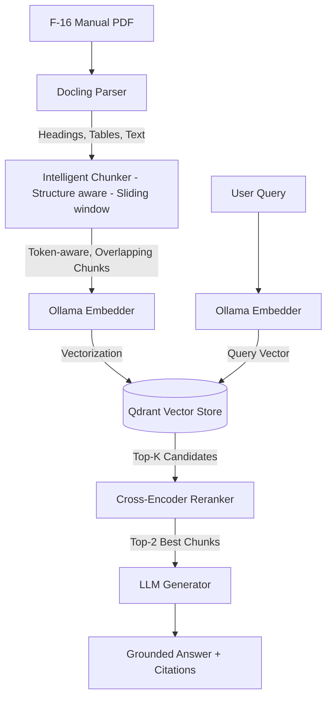
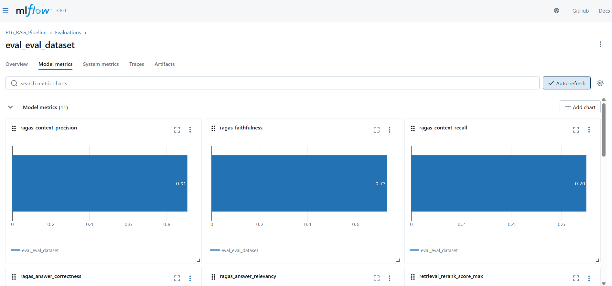

# F-16 Technical Manual RAG Pipeline

Retrieval-Augmented Generation (RAG) pipeline that indexes the technical manual using Docling (PDF parsing), Qdrant (vector store), Ollama (local LLM), and a cross-encoder reranker, with MLflow tracking and RAGAS evaluation.

---

## Pipeline Demo
Watch the 1-minute demonstration of the F-16 Technical Manual RAG Pipeline in action:

<video src="img/pipeline_demo.mp4" width="100%" controls></video>

*(If the video does not play, you can [download it here](img/pipeline_demo.mp4))*

---

## 🏗️ Architecture



---

## Features

### Document Processing
- **Docling 2.x PDF parsing** — extracts paragraphs, headings, tables (TableFormer ACCURATE mode), and figure captions from scanned and native PDFs
- **EasyOCR integration** — handles scanned/image-based PDF pages
- **Hash-based caching** — re-parse only when the PDF changes (SHA-256 file hash comparison)

### Chunking
- **Sentence-boundary aware** — uses spaCy (`en_core_web_sm`) for sentence detection; falls back to sentencizer if model not installed
- **Token-based sliding window** — chunks respect max/overlap token limits (not character counts) for accurate embedding model compatibility
- **Per-element chunking** — headings flush the paragraph buffer; tables chunked separately with row-level splitting if oversized
- **Deterministic chunk IDs** — UUIDv5 based on content + metadata ensures idempotent re-indexing

### Vector Store (Qdrant)
- **Cosine distance** with automatic vector normalization at query time
- **On-disk vector storage** — RAM-efficient for large collections
- **Payload indexes** on `page`, `section_heading`, `chunk_type`, `source_doc` for filtered search
- **Batch upsert** with configurable batch size (default: 64 chunks/request)
- **Idempotent indexing** — upsert overwrites existing points by ID (no duplicates on re-run)

### Retrieval Pipeline
- **Two-stage retrieval**: vector ANN (top-k initial) → cross-encoder reranking (top-k final)
- **Alibaba-NLP/gte-reranker-modernbert-base** — fast, 8192 token context limit, strong performance
- **Per-query latency tracking** — retrieval, rerank, and generation times logged separately

### Generation
- **Grounded RAG template** — strict instruction not to use external knowledge
- **Local Ollama LLM** — llama3.1:8b-instruct-q4_K_S (4-bit quantized, CPU/GPU)
- **"NOT_IN_CONTEXT" fallback** — model instructed to flag out-of-domain queries

### Evaluation Framework
- **Dataset generation** (`eval/eval_dataset.py`) — samples chunks, generates queries, retrieves contexts, generates golden answers
- **RAGAS metrics** (`eval/eval_metrics.py`) — context precision, recall, relevancy, answer correctness, faithfulness
- **LLM-as-judge** (`eval/llm_as_judge.py`) — correctness, fluency, factual grounding scoring
- **MLflow integration** — all params, metrics, and artifacts logged per run

### Experiment Tracking
- **MLflow** — local tracking (`./mlruns`), no server required for local use
- **Per-step timing** — parse, chunk, embed, index times logged as metrics
- **Config snapshot** — all hyperparameters logged per run for reproducibility

### User Interface
- **4-tab Streamlit UI** — Query, Pipeline Control, Evaluation Results, System Info
- **Source chunk explorer** — view retrieved chunks with page/section metadata and scores
- **Eval results dashboard** — RAGAS metric cards with color-coded quality indicators
- **System health indicators** — live Qdrant and Ollama connectivity status

---

## Quick Start

```bash
# 1. Setup environment

# Activate Conda environment
conda activate RAG

# Install dependencies
pip install -r requirements.txt

# Install spacy model
python -m spacy download en_core_web_sm

# Verify
python -c "import spacy; nlp = spacy.load('en_core_web_sm'); print ('spaCy OK')"

# 2. Start Qdrant (Docker)
docker run -d -p 6333:6333 -p 6334:6334 `
-v ${PWD}/qdrant_storage:/qdrant/storage `
qdrant/qdrant

**Port 6333:** REST API (used by qdrant-client in this project)
**Port 6334:** gRPC API (optional, higher throughput for production)

# Dashboard (browser)
# http://localhost:6333/dashboard

# 3. Start Ollama
ollama serve  # separate terminal

# 4. Pull models
ollama pull nomic-embed-text
ollama pull llama3.1:8b-instruct-q4_K_S

# 5. Index the document (step by step)
python run_pipeline.py --pdf data/F_16_manual.pdf --mode parse # Can be scaled to multi-document if needed as well
python run_pipeline.py --mode chunk
python run_pipeline.py --mode index

# MLflow UI 
mlflow ui --port 5000
Open: http://localhost:5000

# 6. Launch UI
streamlit run app.py
```

---

## Directory Structure

```
RAG_Pipeline/
├── app.py                   # Streamlit UI
├── run_pipeline.py          # CLI: parse / chunk / index / all
├── requirements.txt         # Pinned dependencies
├── .env                     # Local config (not committed)
├── .gitignore
│
├── src/                     # Core pipeline modules
│   ├── config.py            # All config with .env overrides
│   ├── parser_docling.py    # PDF -> structured elements
│   ├── chunker.py           # Elements -> token-windowed chunks
│   ├── embedder_ollama.py   # Batch embedding via Ollama API
│   ├── qdrant_store.py      # Qdrant CRUD + search operations
│   ├── reranker.py          # Cross-encoder reranker (HuggingFace)
│   ├── generator_ollama.py  # Answer generation via Ollama API
│   ├── orchestrator.py      # Query-time pipeline orchestration
│   ├── mlflow_tracker.py    # Experiment tracking
│   └── utils.py             # Tokenizer, spaCy, ID generation, sliding window
│
├── eval/                    # Evaluation framework
│   ├── eval_dataset.py      # Generate Q&A evaluation pairs
│   ├── eval_metrics.py      # RAGAS + retrieval metrics
│   └── llm_as_judge.py      # LLM scoring pipeline
│
├── data/                    # PDF + chunks.json
├── output/                  # Parsed JSON + eval_results.json
├── dataset/                 # eval_dataset.csv + judged_results.jsonl
├── mlruns/                  # MLflow experiment runs (local)
├── models_cache/            # HuggingFace model weights
└── qdrant_storage/          # Qdrant on-disk vector storage
```

---

## Tech Stack

| Component | Technology |
|---|---|
| PDF Parsing | Docling |
| OCR | EasyOCR |
| Embedder | nomic-embed-text (via Ollama) |
| Vector Store | Qdrant |
| Reranker | Alibaba-NLP/gte-reranker-modernbert-base |
| Generator | llama3.1:8b-instruct-q4_K_S (via Ollama) |
| Tokenizer | tiktoken cl100k_base |
| Sentence Splitting | spaCy en_core_web_sm |
| Evaluation | RAGAS |
| Experiment Tracking | MLflow |
| UI | Streamlit |
| Charts | Plotly |

---

## Environment Variables

All defaults can be overridden in `.env`. See `.env.example` for all options.

| Variable | Default | Description |
|---|---|---|
| `QDRANT_URL` | `http://localhost:6333` | Qdrant server URL |
| `QDRANT_COLLECTION` | `Manual_Collection` | Collection name |
| `OLLAMA_BASE_URL` | `http://localhost:11434` | Ollama server URL |
| `EMBED_MODEL` | `nomic-embed-text:latest` | Embedding model |
| `GEN_MODEL` | `llama3.1:8b-instruct-q4_K_S` | Generator model |
| `RERANKER_MODEL` | `Alibaba-NLP/gte-reranker-modernbert-base` | Cross-encoder model |
| `MAX_CHUNK_TOKENS` | `1000` | Max tokens per chunk |
| `CHUNK_OVERLAP_TOKENS` | `100` | Overlap between chunks |
| `TOP_K_INITIAL` | `8` | ANN candidates before reranking |
| `TOP_K_FINAL` | `2` | Final chunks passed to generator |
| `MLFLOW_TRACKING_URI` | `./mlruns` | MLflow tracking location |

---

## Evaluation Commands

```bash
# Generate evaluation dataset (Prefer large models for evaluation and golden answers) 
# Also generate manual curated evaluation dataset for better retrieval/generator performance analysis
python -m eval.eval_dataset --chunks 30 --output dataset/eval_dataset.csv

# Run RAGAS evaluation metrics
python -m eval.eval_metrics --dataset dataset/eval_dataset.csv

# LLM-as-judge scoring
python -m eval.llm_as_judge --dataset dataset/eval_dataset.csv --output dataset/judged_results.jsonl

# Metrics evaluated (RAGAS) -> Context precision, Context recall, Answer relevancy, Answer correctness, Faithfulness
# Metrics evaluated (LLM-as-judge) (0-5 Grade based) -> Correctness, Fluency, Factual Grounding, Explanation 

# View MLflow Runs in browser (Parsing - Indexing - Chunking - Evaluation)
mlflow ui --port 5000
# Open: http://localhost:5000
```

### Pipeline Tracking (MLflow)


---

## License

This project is licensed under the MIT License. See the [LICENSE](LICENSE) file for details.